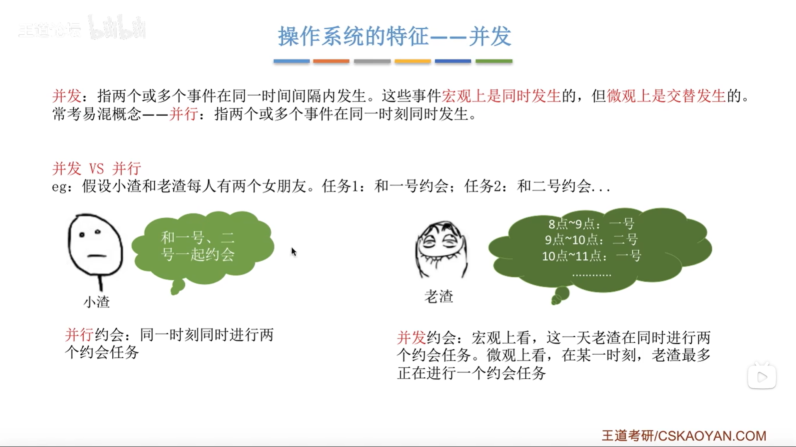
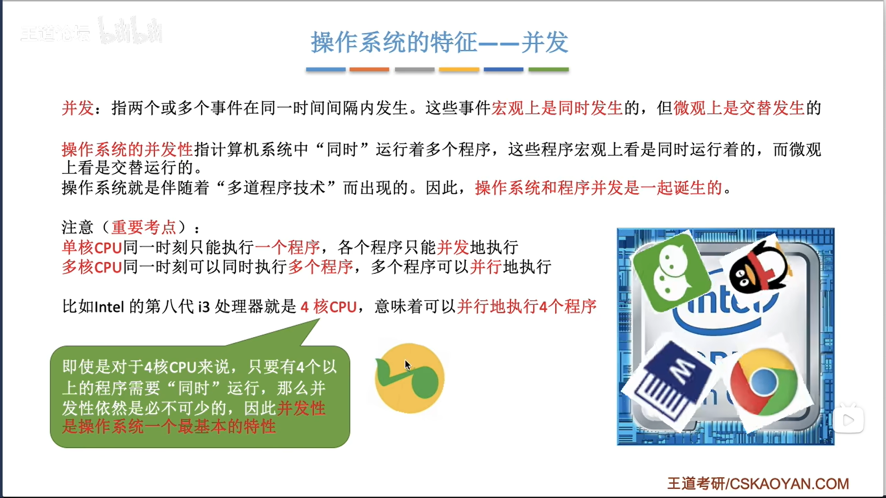
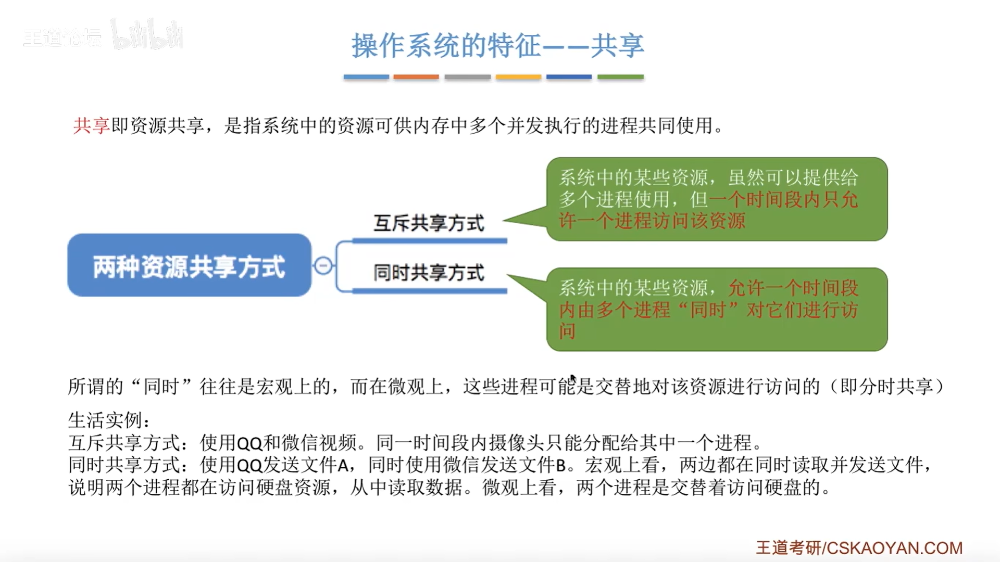
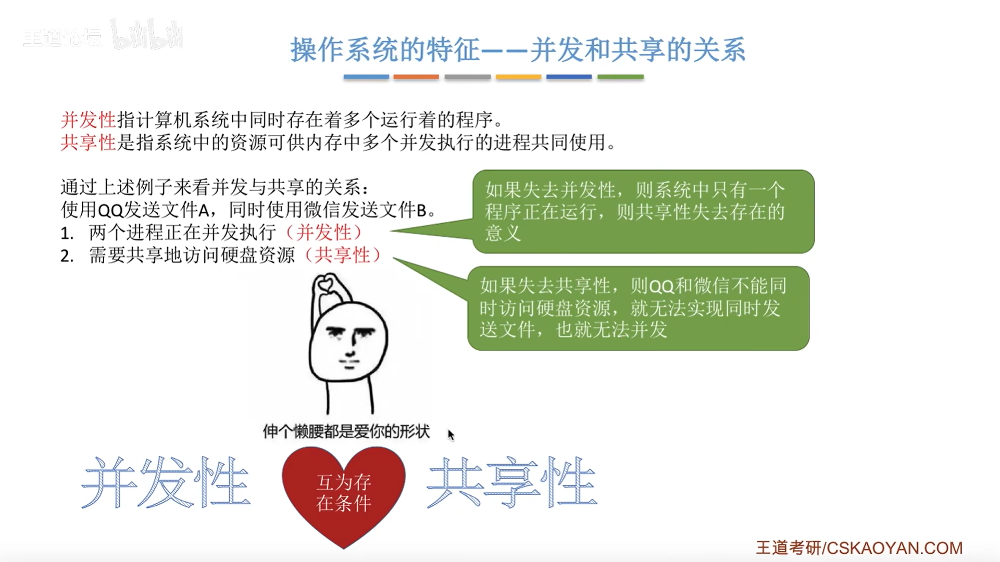
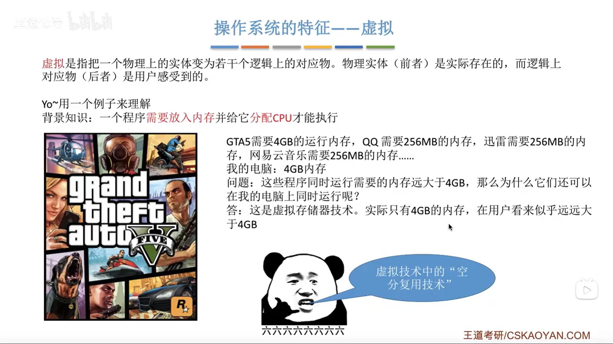
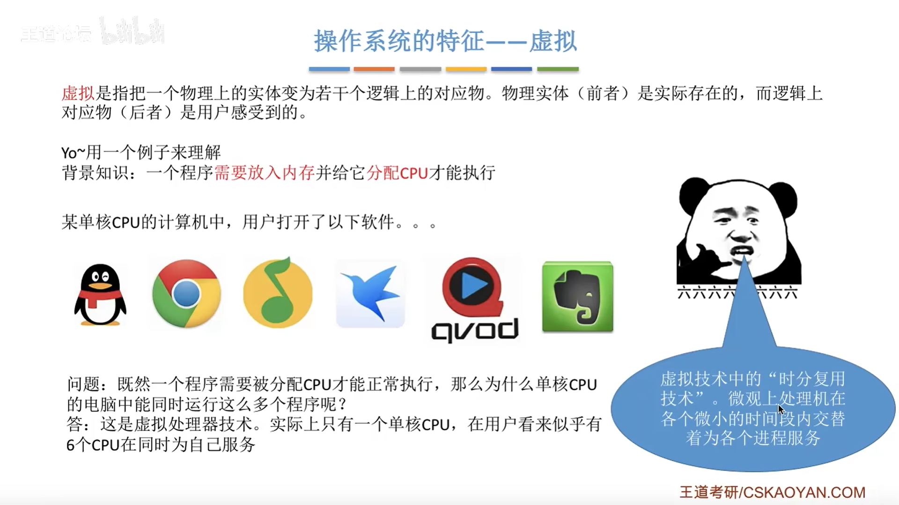
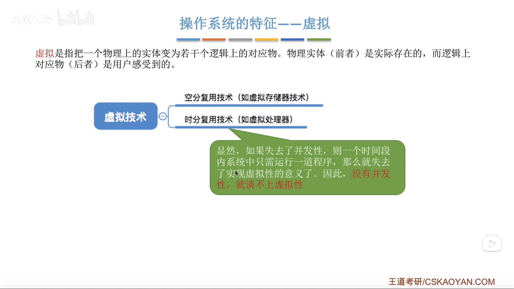
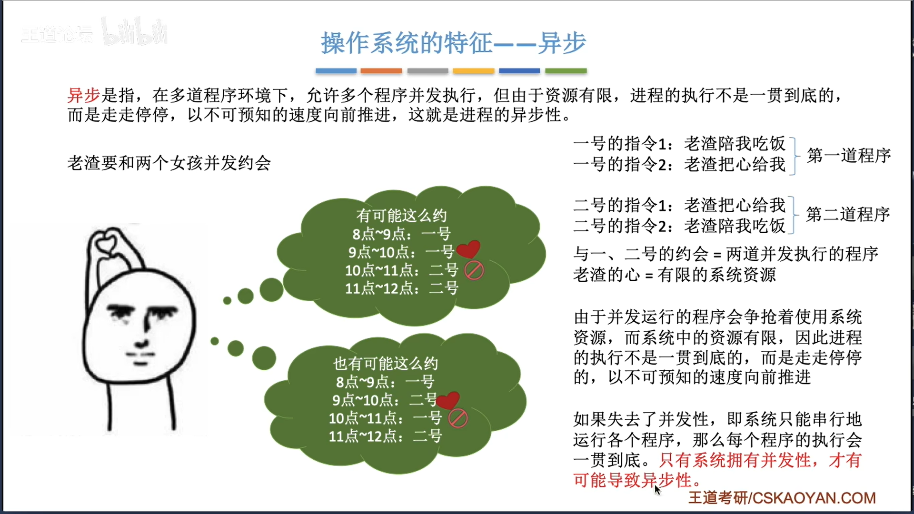
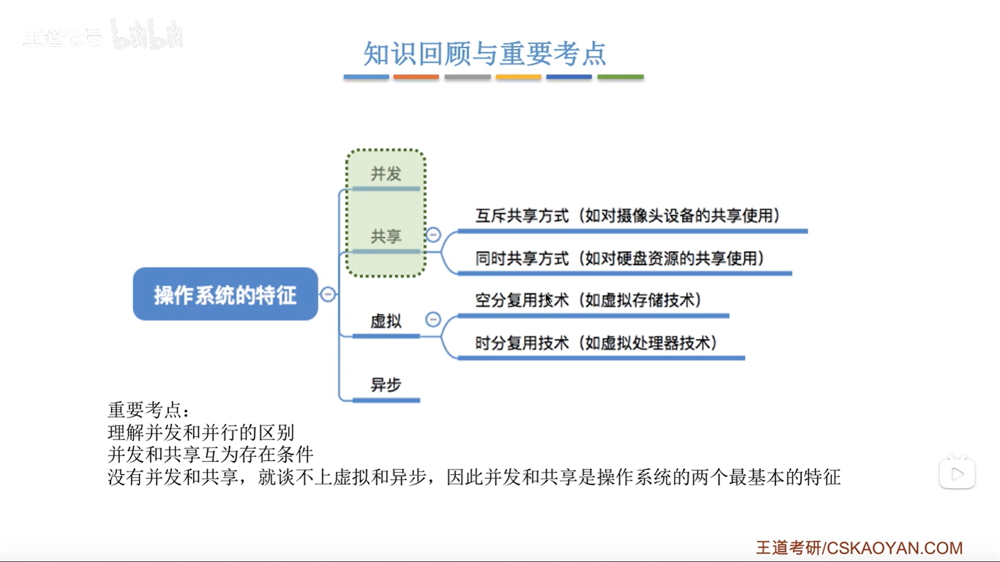

# 操作系统的特征
## 1.操作系统的特征--并发
并发:指两个或多个事件在同一时间间隔内发生。这些事件在宏观上是同时发生的，但微观上是交替发生的。
常考易混概念--并行：指两个或多个事件在同一时刻同时发生。

## 2.操作系统的特征--共享

### 2.1并发和共享的关系

### 3.操作系统的特征--虚拟

### 4.操作系统的特征--异步

### 5.知识回顾
